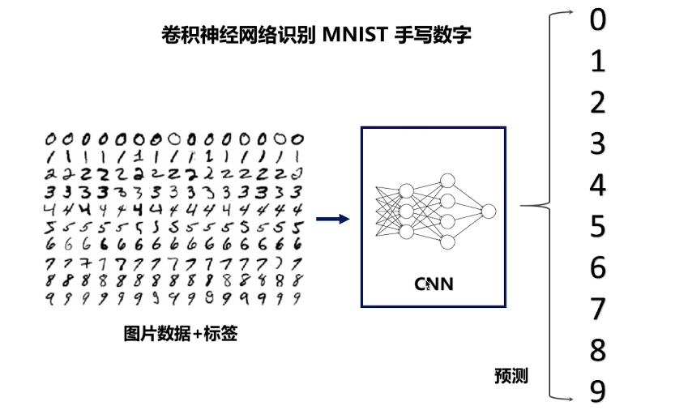
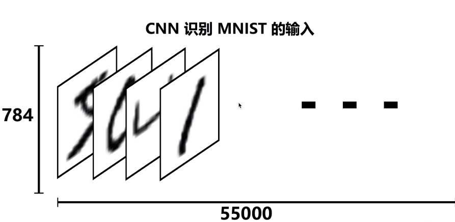
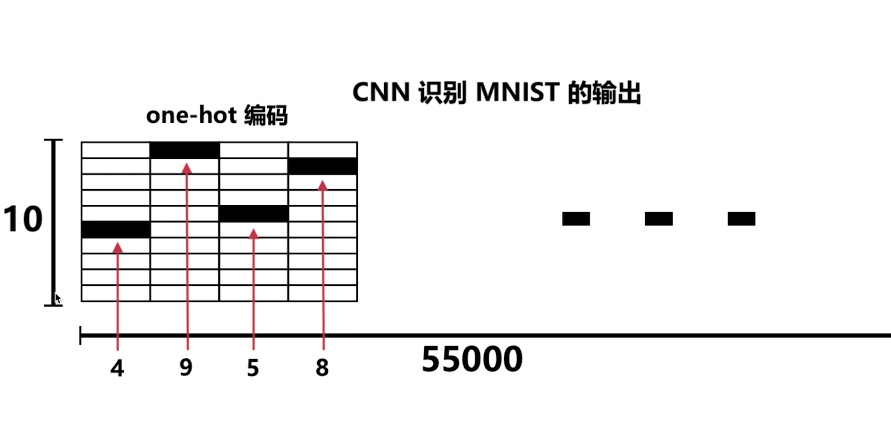
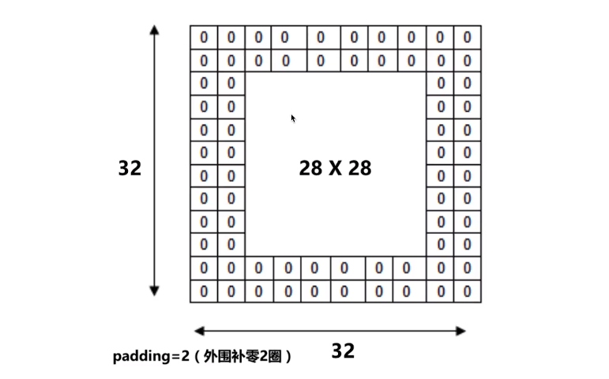
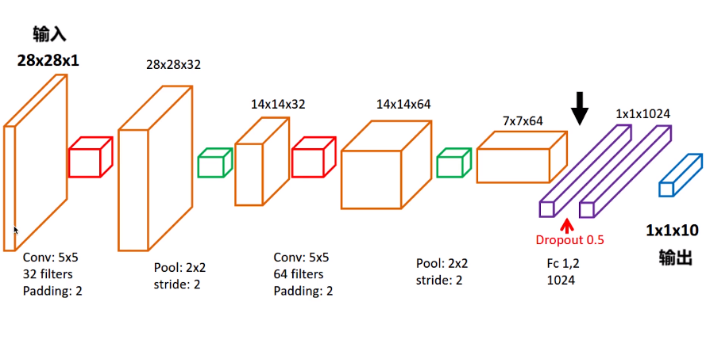
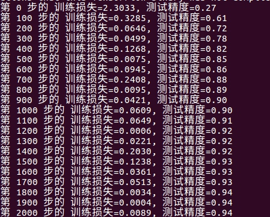

# CNN

目标如下

识别输入的过程

****784 为28*28 共 55000 张图片

padding 意义图示：

流程：

1. 第 1 层卷积 `28*28*1` => `28*28*32`  
 使用 32 个大小为 `5*5` 过滤器 filter 进行处理
1. 第 1 层池化（亚采样）  
 再使用 一个 `2*2` 的过滤器吗，以步长为2进行处理，得到 `14*14*32`
1. 第 2 卷积层  
 使用 64 个大小为 `5*5` 过滤器 filter 进行处理
1. 第 2 层池化（亚采样）  
 再使用 一个 `2*2` 的过滤器吗，以步长为2进行处理，得到 `7*7*64`
1. 平坦化  
1. 1024 个神经元的全连接层
1. Dropout : 丢弃 50%（rate=0.5）
1. 10 个神经元的全连接层，输出目标数字
1. 计算误差
1. Adam 优化器来最小化误差
1. 精度 计算 预测值 和 实际标签 的匹配程度

训练效果：

